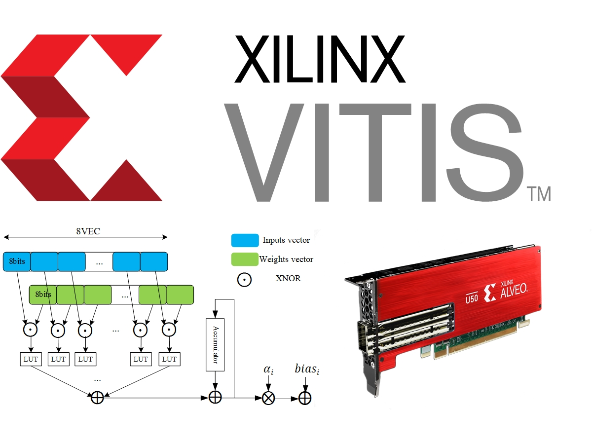

# BJTU BNN Accelerator

In this work we design a generic FPGA accelerator design aiming at accelerating BNN neural networks with high performance in accuracy. In this work we only adapt IR-Net on it, we will fit more BNN models in the future. The FPGA design was based on our open-source work of [PipeCNN](https://github.com/doonny/PipeCNN), and was fully modified and optimized to fit the Xilinx Vitis design flow. The hardware platform used was Alveo U50 Acceleration card.



## How to use

The brief user guide is given bellow, for more detailed information about this project, please see the [**readme.pdf**](./Readme.pdf).

1. Set up the Vitis environment, you can follow the [UG1393](https://www.xilinx.com/support/documentation/sw_manuals/xilinx2019_2/ug1393-vitis-application-acceleration.pdf). Our experimental platform is:

   ```bash
   OS:   ubuntu 18.04 LTS
   Tool: Vitis v2020.1 (64-bit)
   Card: Alveo U50
   BSP:  xilinx_u50_gen3x16_xdma_201920_3
   ```

2. Clone the [repository](https://github.com/dezengzang/BJTU-BNN-Accelerator) and download the fixpoint model files from [Google Driver](https://drive.google.com/drive/folders/1r0mLMpuIgdFSeMIqJV9UkhIr0fCJ9liI?usp=sharing) or [Baidu disk](https://pan.baidu.com/s/1x-iKbuM_fdBY2JeYiHzVdQ#list/path=%2F) (secret code is 9nc4). Then copy the model file directory to the **BJTU-BNN-Accelerator/project/data** directory.


3. Go to the project directory, and make.
    ```bash
    cd BJTU-BNN-Accelerator/project/
    make all
    ```

4. Once the make operation finished, you can run

   ```bash
   ./run.exe conv.xclbin
   ```

5. The result calculated by the accelerator will be verified by comparing with the golden reference. And the time consumption will be reported.